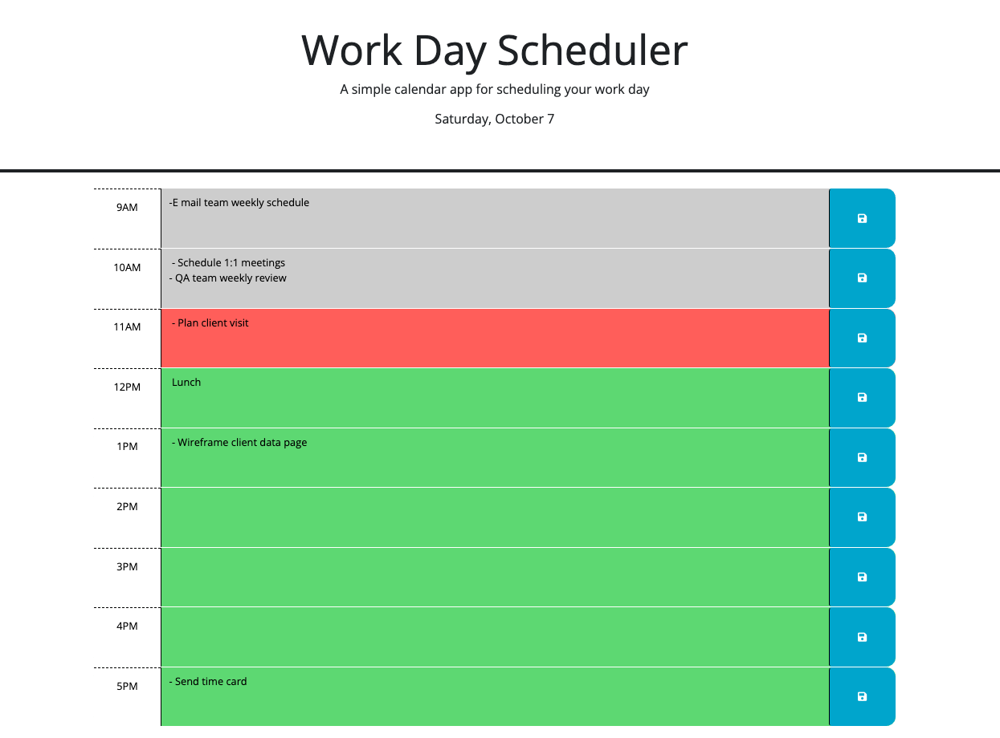
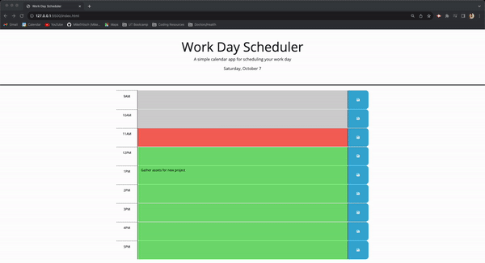

# Day Planner

## Description

The Day Planner App is a user-friendly and efficient tool designed to help you organize your day, stay on top of your tasks, and make the most out of your time. With its intuitive interface and utilization of local storage, this app is perfect for individuals looking to boost their productivity and manage their daily schedules effectively. This app provides real time based updated to follow you along during the 9-5 workday. On top of wanting to build my JavaScript and jQuery skills, this project was born out of a necessity to have a customizable day planner that exists on the web. I learned how to traverse the DOM using jQuery methods and time based events using dayJS.

## Links

[Deployed Page](https://miketritsch.github.io/day-planner/)

[GitHub Repo](https://github.com/MikeTritsch/day-planner)

## What comes next? and other issues...

Going into this challenge, I was slightly lost in traversing jQuery. Thanks to their documentation, I was able to figure out what I needed to do to get this up and running.

Moving forward, I'd like to continue practicing code consolidation. As you can see in my script.js file, specifically my localStorage functions, I have the same function repeated 8 times, which I'm sure can be streamlined.

## Installation

N/A

## Usage

Upon loading the page for the first time, you will be met with an empty 9AM to 5PM schedule divided into hourly sections.

Here is the color code breakdown:

    -Green are future hours

    -Red is present hour

    -Gray is/are the past hour(s).

To add events, simply click on the space next to the time slot and add your events in whatever format you chose.

Once finished, click the blue SAVE ICON on the right side of the entry space.
Clicking save will ensure your events are saved to your local storage, making them stick around after you close or refresh the page.

There are two ways to remove events.

1. Clear your local storage and then refresh (open the Chrome DevTools by pressing Command+Option+I (macOS) or Control+Shift+I (Windows))

2. Remove the text from the time slots

## Credits

Huge thank you to Jose Centurion for helping me consolidate the conditional statements.

## License

MIT License

Copyright (c) 2023 Mike Tritsch

Permission is hereby granted, free of charge, to any person obtaining a copy
of this software and associated documentation files (the "Software"), to deal
in the Software without restriction, including without limitation the rights
to use, copy, modify, merge, publish, distribute, sublicense, and/or sell
copies of the Software, and to permit persons to whom the Software is
furnished to do so, subject to the following conditions:

The above copyright notice and this permission notice shall be included in all
copies or substantial portions of the Software.

THE SOFTWARE IS PROVIDED "AS IS", WITHOUT WARRANTY OF ANY KIND, EXPRESS OR
IMPLIED, INCLUDING BUT NOT LIMITED TO THE WARRANTIES OF MERCHANTABILITY,
FITNESS FOR A PARTICULAR PURPOSE AND NONINFRINGEMENT. IN NO EVENT SHALL THE
AUTHORS OR COPYRIGHT HOLDERS BE LIABLE FOR ANY CLAIM, DAMAGES OR OTHER
LIABILITY, WHETHER IN AN ACTION OF CONTRACT, TORT OR OTHERWISE, ARISING FROM,
OUT OF OR IN CONNECTION WITH THE SOFTWARE OR THE USE OR OTHER DEALINGS IN THE
SOFTWARE.

---